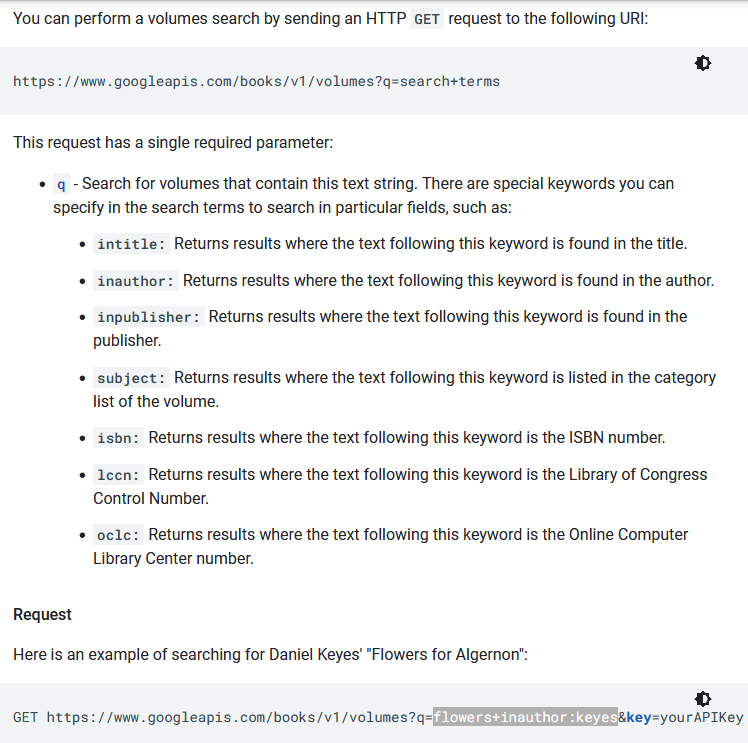
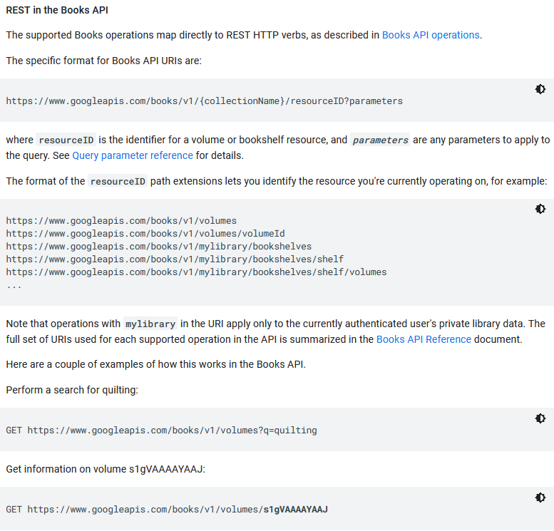
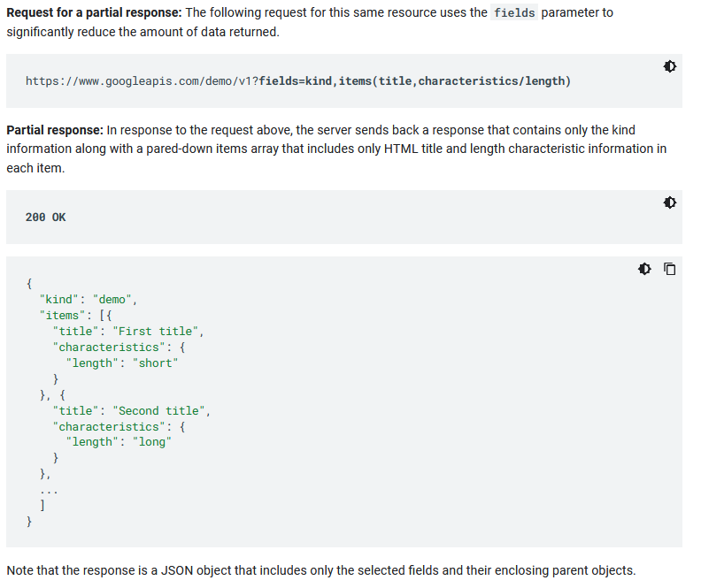
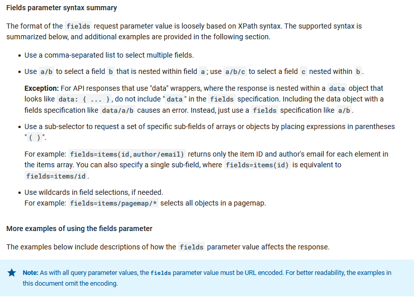
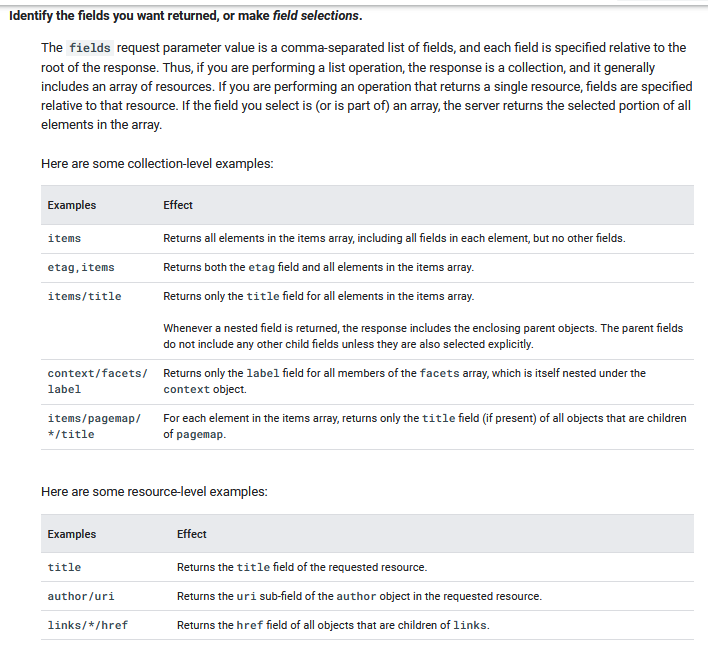
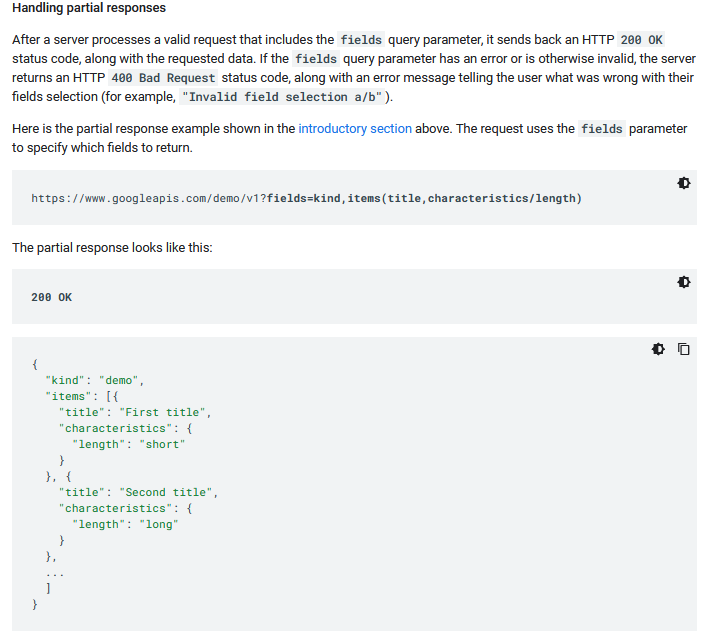

# Info About the API

#### [Back to main README](../README.md)

### Notes
* Google Books V1 is the API I am using to scrape info about cookbooks
  * So far I am having success with it.
* [Google API V1 Link (Current)](https://developers.google.com/books/docs/v1/using)
* [Google API V2 Info (Backup)](https://developers.google.com/books/docs/static-links)
* [OpenLibrary API (Backup Backup)](https://openlibrary.org/dev/docs/api/books)

### Commands Examples
#### Endpoint
- https://www.googleapis.com

#### Resource
- /books/v1/volumes

#### Parameters (Multiple Examples)
- ?q=alton+brown
- ?q=isbn:9780672337956
- ?q=flowers+inauthor:keyes

#### Filtering Results (Multiple Examples)
- [Info of Filtering](https://developers.google.com/books/docs/v1/performance)
- fields=kind,items(title,characteristics/length)
- fields=items

#### Total String Example
- https://www.googleapis.com/books/v1/volumes?fields=items&q=isbn:9780672337956
- String with URL encoding.  %28 %29 = () AND %2C = ,
  - https://www.googleapis.com/books/v1/volumes?fields=items/volumeInfo%28title%2Cauthors%2Cpublisher%2CpublishedDate%2Cdescription%2CindustryIdentifiers%2CpageCount%2Ccategories%2CmaturityRating%2CimageLinks%2Clanguage%29&q=isbn:9780672337956

### Images
Good List of Search Commands.
* 

More Examples of Google Books
* 

### Images Related Specifically To Filtering
* 
* 
* 
* 