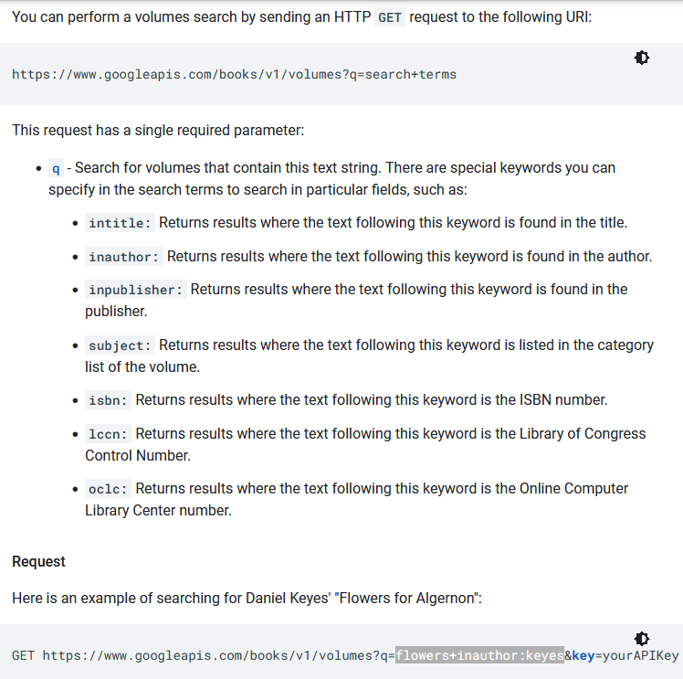

# Info About the API

#### [Back to main README](../README.md)

### Notes
* Google Books is the API I am using to scrape info about cookbooks.
* [Google API V1 Link](https://developers.google.com/books/docs/v1/using)

### Commands Examples
#### Endpoint
- https://www.googleapis.com

#### Resource
- /books/v1/volumes

#### Parameters (Multiple Examples)
- ?q=alton+brown
- ?q=isbn:9780672337956
- ?q=flowers+inauthor:keyes

### Images
* 