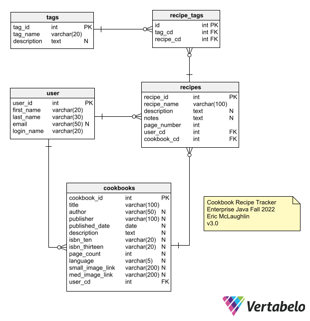

# Database Design
#### [Back to main README](../README.md)

### Current Database ERD
v3.0

### Notes
* Database Name: RecipeTracker
* One junction tables.  
  * One for tags which will have shared FK PK
* Users table works in conjunction with AWS.
* Cookbooks table works in conjunction with Google Books API (but also manual additions)

### SQL Scripts
* [SQL Full Refresh Script](SqlScripts/Databasev3.0FullRefresh.sql)) 
* [SQL Create Script](SqlScripts/Databasev3.0Create.sql)
* [SQL Drop Script](SqlScripts/Databasev3.0Drop.sql)

#### Previous Database ERDs
v1.9 [Database ERD](LayoutPictures/DatabaseERDv1.9.png)

v1.8 [Database ERD](LayoutPictures/DatabaseERDv1.8.png)

v1.7 (note picture says 1.6 but it is 1.7) [Database ERD](LayoutPictures/DatabaseERDv1.7.png)

v1.5 [Database ERD](LayoutPictures/DatabaseERDv1.5.png)

v1.0 [Database ERD](LayoutPictures/Database%20ERD%20v1.0.png)

v2.0 [Database ERD](LayoutPictures/DatabaseERDv2.0.png)