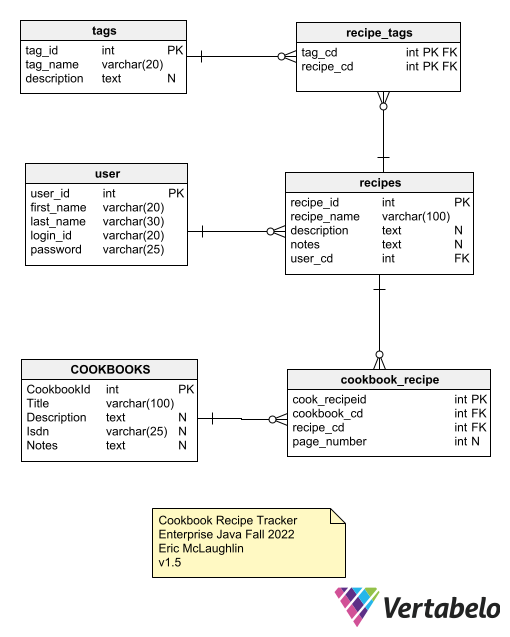

# Database Design

### Current Database ERD
v1.5

### Notes
* Database Name: RecipeTracker
* Two junction tables.  
  * One for tags which will have shared FK PK
  * One for Cookbook and Recipe connections.  This requires an extra page number column so will have and designated PK Id
* I believe Users will be done using AWS but have included it for now.
* Cookbooks may also change since it will use an API and I don't know how that works yet.

#### Previous Database ERDs
v1.0

