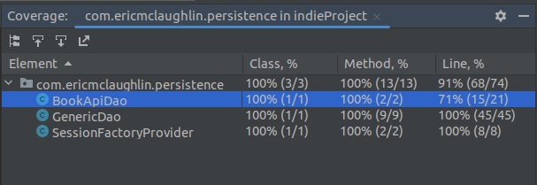
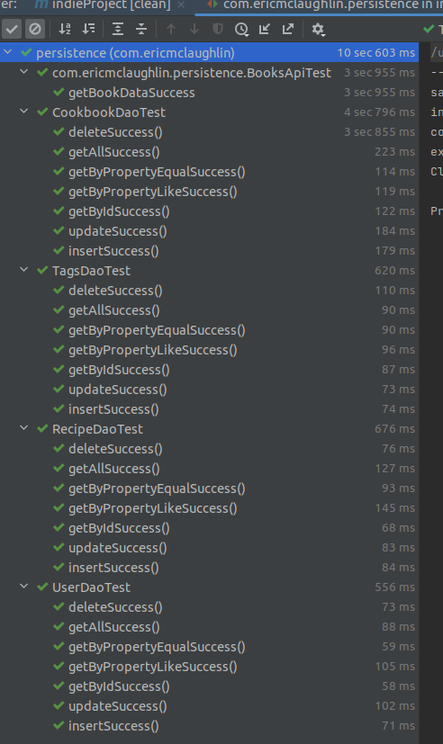

## Presentation

RecipeWhere? is an application that allows users to keep track of their physical recipes.

My wife, in particular, is always having difficulty finding recipes in her cookbooks which is what motivated me to build this.  She has added tabs on the recipes she likes but still has no good way to track what each tab means.  She often then has to search through every tab because she remembers a recipe but not the cookbook or location in said cookbook. This app is an attempt to alleviate that extra work/time.

Users can create an account and then enter their cookbooks into the app.  They can do this by just entering an ISBN number from the back of the book.  The app takes that number and searches Google Books for information about the book and populates it into the program. If, there is no ISBN or if Google Books does not have the info, users can opt to enter the book info manually.

Once the cookbooks are entered, users can then enter recipes in and associate them with a given cookbook and page number.

The recipes and cookbooks are searchable and organizable, so users can search for the recipe by name or just browse through for inspiration.

#### [README (Cookbook Picture and Links)](../README.md)

### Unique Parts of Project
Google API

### Code Coverage

### Takeaways
Overall, this was a very challenging project (and class) for me.  Throughout much of the course, I had my doubts that I would be able to get this project done at all.  Ultimately, I was able to break the project down piece by piece and created something that I am pretty proud of.  

Some parts went really well, such as implementing the database design and genericDao, and getting the api implemented.  

Other parts were really challenging for me.  Though I got the API added quickly enough, figuring out how to get the data I needed out of it was a bit of work.  Also, getting sorting and searching of the recipes and cookbooks is another good example.  Lastly, i found the formatting of the jsp pages to be a horrendous task and pretty much sealed my fate as a backend developer.

There are also some parts that did not get fully implemented that I really would like to add.  I do plan to keep expanding on this so I think it will not be long before they are implemented.

The biggest thing I want to get added is the ability to add searchable tags to each recipe.  I do have that built into the database now and have the entities built but it did not make it into the project.  I had some struggles with the many to many connection required and ultimately left it behind for now.  Another thing I want to add is the ability to rate recipes and the ability to add pictures of recipes.

In the end, though, i learned a ton while working throught this project.  As I stated before, i did not have much confidence in my ability before I started the project.  My understanding has grown tremendously and I feel confident that I will continue to get better with every future project.

