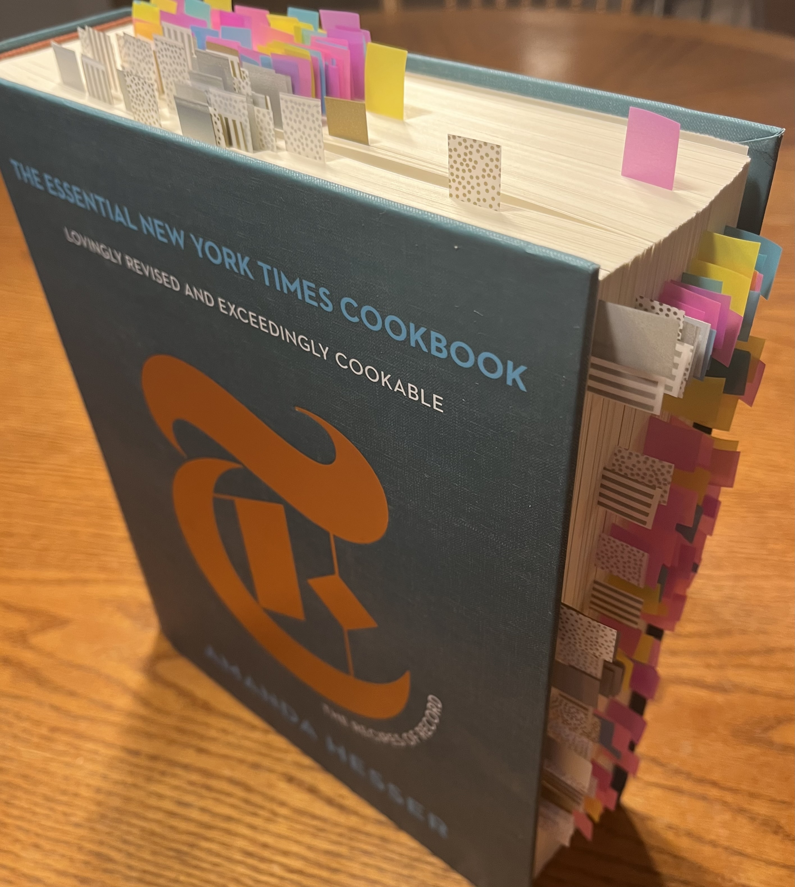

# Cookbook Recipe Tracker Individual Project

## Problem Statement
We have a large collection of cookbooks and are looking for a way to utilize them better.  
We often run into situations where we want to cook something and remember seeing the 
perfect recipe but cannot remember which book it is in.  To mitigate this, we have several 
books that are full of tabs marking the various recipes, but it is still difficult to track 
what recipe is at each tab.  we have tried to create keys for the tabs but the whole thing 
turns into a mess before long.

This app is an effort to resolve these issues.  Users will be able to create an account and 
then enter info about important recipes into it.  Most notably, users would enter recipe 
name, a short description, some keywords/tags, the cookbook where the recipe is located, 
and, most importantly, the page number.

Once recipes are entered, users can browse through them on their homepage and see 
info/notes about each recipe.  Users will also be able to search using recipe name or 
keywords.  When a recipe is found, it will then point the user to the appropriate cookbook 
and page number.

### Additional Notes
* We have the recipe in the books so the user would not need to invest time in copying it 
all over; just the book title and page number are sufficient.
* An API, such as Google Books, will be used to pull info about the cookbooks for reference 
and to help users find their books easier.

## Design Related Information
* [User Stories](DesignDocuments/userStories.md)
* [Layout/Mockup Information](DesignDocuments/layoutInformation.md)
* [Project Plan](DesignDocuments/projectPlan.md)
* [Application Flow](DesignDocuments/applicationFlow.md)
* [Database Design](DesignDocuments/databaseDesign.md)
* [API Information](DesignDocuments/apiInfo.md)

## Other Stuff
* [Time Log/Journal](journal.md) for Whole Enterprise Java Class.

## Self-Evaluations
* [Mid Term Evaluation](DesignDocuments/Self-Evaluations/selfEvaluationMidTerm-22-10-30.md)
* [Final Evaluation (Pending)]()
